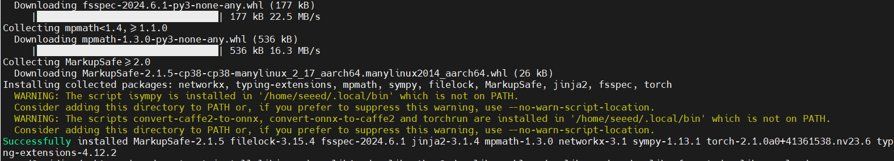

# Pytorch

## Introduction

Deploying PyTorch models to embedded edge devices is a critical step in bringing AI applications to life. [NVIDIA's Jetson platform](https://www.seeedstudio.com/reComputer-J3010-p-5589.html), with its powerful GPU computing capabilities and comprehensive AI software stack, has become an ideal choice for running PyTorch models.

However, because Jetson is based on the ARM architecture, which differs from common x86 server environments, setting up a PyTorch environment on it cannot be accomplished with a simple pip install command. Developers often face challenges such as finding the correct version of pre-compiled packages, managing complex dependencies, and performing necessary performance optimizations.

This article aims to provide a clear and practical guide, focusing on how to quickly and correctly configure the PyTorch environment on the Jetson platform, helping you kickstart your PyTorch development journey on Jetson.


<p align="center">
  <a href="https://www.python.org/">
    
  </a>
  <br>
  <sub>
    Image from：
    <a href="https://pypi.org/project/torch/">pypi</a>
  </sub>
</p>


## Installing PyTorch on reComputer Nvidia Jetson

### Set Up Your Environment

- JetPack 5/6:
    Make sure you have NVIDIA JetPack 5 or 6 installed on your reComputer. JetPack includes the necessary libraries and tools for developing on NVIDIA Jetson platforms.

- CUDA:
    Verify that CUDA is installed and properly configured. PyTorch relies on CUDA for GPU acceleration. Ensure that the CUDA version installed is compatible with the PyTorch version you plan to install. 

> Type `cat /etc/nv_tegra_release` and `nvcc -V` in your terminal. If the returned content is similar to the screenshot below, it indicates that the corresponding environment has been properly installed in your Jetson.
> <p align="center"></p>

### Installing PyTorch Using a .whl File
To install PyTorch on your reComputer with the specified JetPack and CUDA versions, follow these steps:

#### Download the PyTorch Wheel File

Choose the correct wheel file based on your JetPack, CUDA and python version:


- **JetPack 7**:
  - [PyTorch 2.9](https://seeedstudio88-my.sharepoint.com/:u:/g/personal/youjiang_yu_seeedstudio88_onmicrosoft_com/EVe_c8F4DR9CluC049HCYoMBhHsIH0QMDQF2Q_kPEWOMcQ?e=xaW7vC)
  - [Torchvision 0.24](https://seeedstudio88-my.sharepoint.com/:u:/g/personal/youjiang_yu_seeedstudio88_onmicrosoft_com/ESDkmxLfCW1MkI8YBfrdWVABKNXimZSq0qcDoApbzJazZw?e=8JOUMy)

- **JetPack 6.1 & 6.2 (L4T R36.4) + CUDA 12.6**:
  
  - [PyTorch 2.7](https://seeedstudio88-my.sharepoint.com/:u:/g/personal/youjiang_yu_seeedstudio88_onmicrosoft_com/EW2ke8EPcVhGsM2mjCMQOWEBcEuOA45rxNmC0FlkBfhPPg?e=bJ0bOz)
  
  - [torchvision 0.22.0](https://seeedstudio88-my.sharepoint.com/:u:/g/personal/youjiang_yu_seeedstudio88_onmicrosoft_com/EXyam8X0U3VNqmio2ZBM6osB1IDAurgvkd6JAsJLnahTcA?e=p85hdo)
  
  - [PyTorch 2.5](https://seeedstudio88-my.sharepoint.com/:u:/g/personal/youjiang_yu_seeedstudio88_onmicrosoft_com/EXZ8MsYzCYdGjR9g3tQwnAIBj1kJodvl-9XQVa9U8XFPZA?e=QJntmH)
  
    if `ImportError: libcusparseLt.so.0: cannot open shared object file: No such file or directory`, install new version [cuSPARSELt 0.8.1](https://developer.nvidia.com/cusparselt-downloads?target_os=Linux&target_arch=aarch64-jetson&Compilation=Native&Distribution=Ubuntu&target_version=22.04&target_type=deb_local) (Select Linux>arrch64-jetson>Native>Ubuntu>22.04>deb(Local)) and [CUDA 12.6](https://developer.nvidia.com/cuda-12-6-0-download-archive?target_os=Linux&target_arch=aarch64-jetson&Compilation=Native&Distribution=Ubuntu&target_version=22.04&target_type=deb_local) (Select Linux>arrch64-jetson>Native>Ubuntu>22.04>deb(Local))
  
  - [torchvision 0.20](https://seeedstudio88-my.sharepoint.com/:u:/g/personal/youjiang_yu_seeedstudio88_onmicrosoft_com/EbaNmRnWK9BHiYRpX4G1VdYBCsxh9qtdQHtsxEN5nAUJhw?e=liIOJ0)
  
    If torchvision reports an error, please uninstall it and refer to the subsequent steps to compile torchvision 0.20.0 via code.
  


  also [Torch-TensorRT in JetPack](https://docs.pytorch.org/TensorRT/getting_started/jetpack.html)

- **JetPack 6.0 (L4T R36.2 / R36.3) + CUDA 12.2**:
  - [PyTorch 2.3](https://seeedstudio88-my.sharepoint.com/:u:/g/personal/youjiang_yu_seeedstudio88_onmicrosoft_com/Ed30wfVKAydNqwsmo_qICDwBu_mcOJ4S3jTuyI11nNer8A?e=tjDWmv) rename to `torch-2.3.0-cp310-cp310-linux_aarch64.whl`
  - [torchvision 0.18](https://seeedstudio88-my.sharepoint.com/:u:/g/personal/youjiang_yu_seeedstudio88_onmicrosoft_com/EY4l6JaUyc5JlPCwlgOUFw0BeVeilxUjcqZLoK4M7WH3TQ?e=lMxO11) rename to `torchvision-0.18.0a0+6043bc2-cp310-cp310-linux_aarch64.whl`

- **JetPack 6.0 DP (L4T R36.2.0)**:
  - [PyTorch 2.2.0](https://developer.download.nvidia.cn/compute/redist/jp/v60dp/pytorch/torch-2.2.0a0+6a974be.nv23.11-cp310-cp310-linux_aarch64.whl)
  - [PyTorch 2.1.0](https://nvidia.box.com/shared/static/0h6tk4msrl9xz3evft9t0mpwwwkw7a32.whl)

- **JetPack 5.x**:
  - **JetPack 5.1 (L4T R35.2.1) / JetPack 5.1.1 (L4T R35.3.1) / JetPack 5.1.2 (L4T R35.4.1)**:
    - [PyTorch 2.1.0](https://seeedstudio88-my.sharepoint.com/:u:/g/personal/youjiang_yu_seeedstudio88_onmicrosoft_com/EbQ3kJ4pMKRCm5AN6wbDCxAB1l2NUKUQ-7R57XY6E6sHHg?e=h8mbr9)
  - **JetPack 5.1 (L4T R35.2.1) / JetPack 5.1.1 (L4T R35.3.1)**:
    - [PyTorch 2.0.0](https://nvidia.box.com/shared/static/i8pukc49h3lhak4kkn67tg9j4goqm0m7.whl)
    - [PyTorch 1.14.0](https://developer.download.nvidia.com/compute/redist/jp/v51/pytorch/torch-1.14.0a0+44dac51c.nv23.02-cp38-cp38-linux_aarch64.whl)
  - **JetPack 5.0 (L4T R34.1) / JetPack 5.0.2 (L4T R35.1) / JetPack 5.1 (L4T R35.2.1) / JetPack 5.1.1 (L4T R35.3.1)**:
    - [PyTorch 1.13.0](https://developer.download.nvidia.com/compute/redist/jp/v502/pytorch/torch-1.13.0a0+d0d6b1f2.nv22.10-cp38-cp38-linux_aarch64.whl)
    - [PyTorch 1.12.0](https://developer.download.nvidia.com/compute/redist/jp/v50/pytorch/torch-1.12.0a0+2c916ef.nv22.3-cp38-cp38-linux_aarch64.whl)
    - [PyTorch 1.11.0](https://nvidia.box.com/shared/static/ssf2v7pf5i245fk4i0q926hy4imzs2ph.whl)

#### Install the Wheel File

1. **Open a Terminal**:
   - Navigate to the directory where you downloaded the `.whl` file.

2. **Install**:
   ```bash
   sudo apt-get install python3-pip libopenblas-base libopenmpi-dev libomp-dev
   pip3 install 'Cython<3'
   pip3 install numpy
   sudo pip3 install <filename>.whl
   ```
   Replace `<filename>` with the name of the downloaded `.whl` file.
    <p align="center">
    <a href="https://www.python.org/">
        
    </a>
    </p>

#### Verify Installation
To verify that PyTorch has been installed correctly on your system, launch an interactive Python interpreter from the terminal and run the following commands:

    ```python
    import torch
    print(torch.__version__)
    print('CUDA available: ' + str(torch.cuda.is_available()))
    print('cuDNN version: ' + str(torch.backends.cudnn.version()))
    a = torch.cuda.FloatTensor(2).zero_()
    print('Tensor a = ' + str(a))
    b = torch.randn(2).cuda()
    print('Tensor b = ' + str(b))    
    c = a + b
    print('Tensor c = ' + str(c))
    ```
    ```python
    import torchvision
    print(torchvision.__version__)
    ```
<p align="center"></p>


## More Tutorial Content

**Tutorial** | **Type** | **Description**
--- | --- | ---
[Official PyTorch Tutorial](https://pytorch.org/tutorials/beginner/basics/intro.html) | doc | An official PyTorch tutorial that provides a complete learning path.
[PyTorch Development Documentation](https://pytorch.org/docs/stable/index.html) | doc | Official PyTorch development documentation provided by PyTorch.
