# Install Docker

​	 Docker is an open platform for building, shipping, and running applications using lightweight, portable containers. A container bundles your app with all its dependencies and runtime into an image, so it runs the same way on any machine—your laptop, a server, or the cloud—without “it works on my machine” issues. Unlike virtual machines, containers share the host OS kernel, making them faster to start and more resource‑efficient. Developers define images with a simple Dockerfile, publish or pull them from registries like Docker Hub, and orchestrate multi‑service setups with Docker Compose. This approach streamlines development, testing, and deployment, improves isolation and security, and makes scaling or rolling back versions straightforward.


## Install the Docker service on Jetson

------

### Install Docker CE

First, update the apt package index：

```bash
sudo apt update
sudo apt install -y apt-transport-https ca-certificates curl software-properties-common
```

Add the official Docker GPG key：

```bash
curl -fsSL https://download.docker.com/linux/ubuntu/gpg | sudo gpg --dearmor -o /usr/share/keyrings/docker-archive-keyring.gpg
```

Add the official Docker repository：

```
echo \
  "deb [arch=$(dpkg --print-architecture) signed-by=/usr/share/keyrings/docker-archive-keyring.gpg] \
  https://download.docker.com/linux/ubuntu \
  $(lsb_release -cs) stable" | sudo tee /etc/apt/sources.list.d/docker.list > /dev/null
```

Install Docker CE：

```
sudo apt update
sudo apt install -y docker-ce docker-ce-cli containerd.io
```

Check the installation:

```
docker --version
```

------

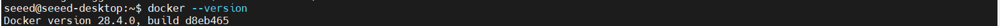

If the version number can be displayed normally, it indicates that the installation was successful.

### Install NVIDIA Container Toolkit

​	**NVIDIA Container Toolkit** is a software suite that enables Docker containers to access NVIDIA GPUs. While Docker itself provides containerization for applications and their dependencies, it does not natively support GPU acceleration. The NVIDIA Container Toolkit bridges this gap by allowing containers to utilize the host’s GPU hardware. It maps NVIDIA drivers, CUDA libraries, and other necessary components into the container, enabling GPU-accelerated workloads such as AI, deep learning, and high-performance computing.

Add NVIDIA GPG key：

```bash
sudo apt-get install curl -y

distribution=$(. /etc/os-release;echo $ID$VERSION_ID)

curl -s -L https://nvidia.github.io/libnvidia-container/gpgkey | sudo gpg --dearmor -o /usr/share/keyrings/nvidia-container-toolkit-keyring.gpg

curl -s -L https://nvidia.github.io/libnvidia-container/$distribution/libnvidia-container.list | \
  sed 's#deb https://#deb [signed-by=/usr/share/keyrings/nvidia-container-toolkit-keyring.gpg] https://#g' | \
  sudo tee /etc/apt/sources.list.d/nvidia-container-toolkit.list
```

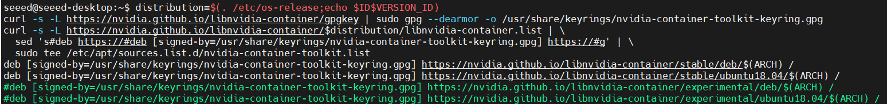

Install NVIDIA Container Toolkit:

```bash
sudo apt update
sudo apt install -y nvidia-container-toolkit
```

Configure Docker to use NVIDIA runtime：

```
sudo nvidia-ctk runtime configure --runtime=docker
sudo systemctl restart docker
```

------

Test whether the GPU can be used in the Docker container.

```bash
sudo docker run --rm --runtime=nvidia --gpus all --network host ubuntu nvidia-smi
```

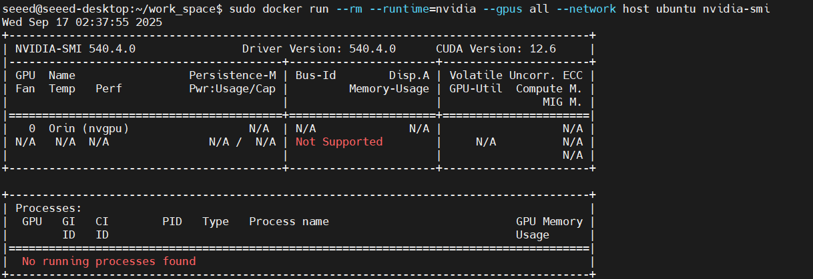

If the above output indicates that CUDA can be used normally within the Docker image, then it is possible to use CUDA within the Docker container.

### [Optional]: Allow non-root users to run Docker

```
sudo usermod -aG docker $USER
newgrp docker
```

After that, you can directly use `docker run` instead of `sudo`.

## Common operation commands of docker

### Pull a docker image from docker hub

```bash
docker pull ultralytics/ultralytics:8.3.201-jetson-jetpack6
```

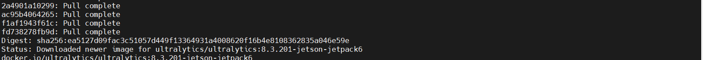

View the pulled image:

```bash
docker image list
```

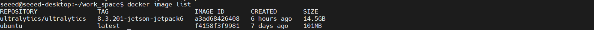

enter docker container:

```bash
docker run --runtime nvidia -it --rm --network=host ultralytics/ultralytics:8.3.201-jetson-jetpack6
```

- **--runtime**  nvidia Specify that the container uses **NVIDIA Container Runtime**, so that the container can access the GPU of Jetson.
- **-it** `-i` Indicating the interactive mode, `-t` assigns a pseudo-terminal.
- **--rm** The container will be automatically deleted after it exits.
- **--network=host**  Allow the container to directly use the host machine's network.


Enter the container and verify whether CUDA can be called normally.

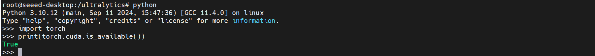

It can be seen that CUDA can be called normally.

```bash
#Check the name of the Docker container
docker ps -a
```

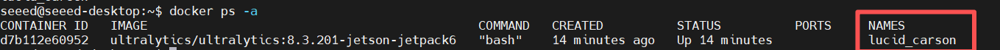

### File transfer

This part is designed to enable the transfer of host files to the container interior or the transfer of files from the container interior to the host.

```bash
#jetson to docker image
docker cp <file> <docker container name/container ID>:<Target folder>
#example
docker cp ./test_file.txt lucid_carson:/ultralytics
```

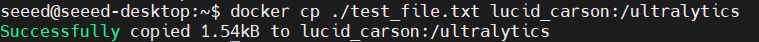

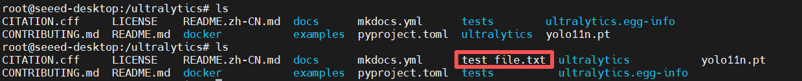

```
#docker to jetson
docker cp <docker container name/container ID>:<Target file> <path to host> 
#example
docker cp lucid_carson:/ultralytics/container_file.txt /home/seeed
```

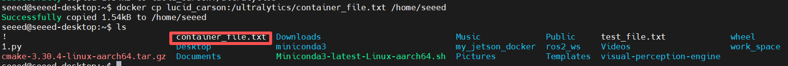

### Package the image

```bash
#Check the container name
docker ps -a
```

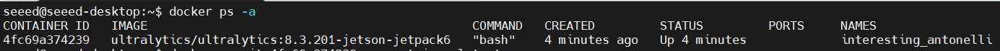

Package it as an image file:

```bash
 #docker commit <container ID> <new image name:tag>
 docker commit 4fc69a374239 my_container:latest
```

 This will create a new image.

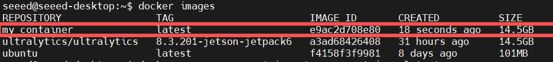

将新创建的镜像进行打包

```bash
#docker save -o <file name> <REPOSITORY name:TAG>
docker save -o my_container.tar my_container:latest
```

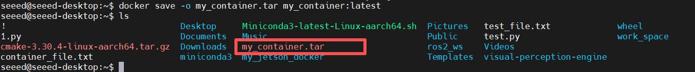

After the packaging is completed, a.tar file will be generated.

### Load the.tar image

```bash
docker load -i my_container.tar
```

### Push the image to Docker Hub

```bash
#登录到docker hub
#docker login -u <username>
docker tag my_containe:latest your-dockerhub-username/my-ultralytics:latest
docker push your-dockerhub-username/my-ultralytics:latest

```

### Delete the image

```bash
docker rmi my_containe:latest
```


## Reference materials

If you want to learn more about Docker operations, please refer to [here](https://docs.docker.com/guides/)