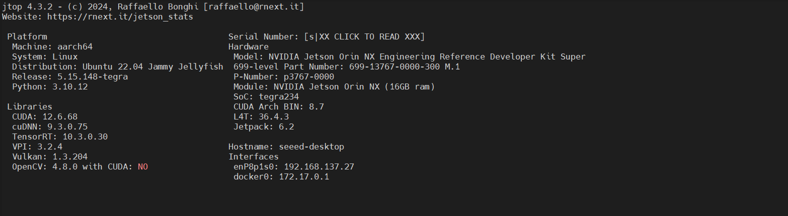
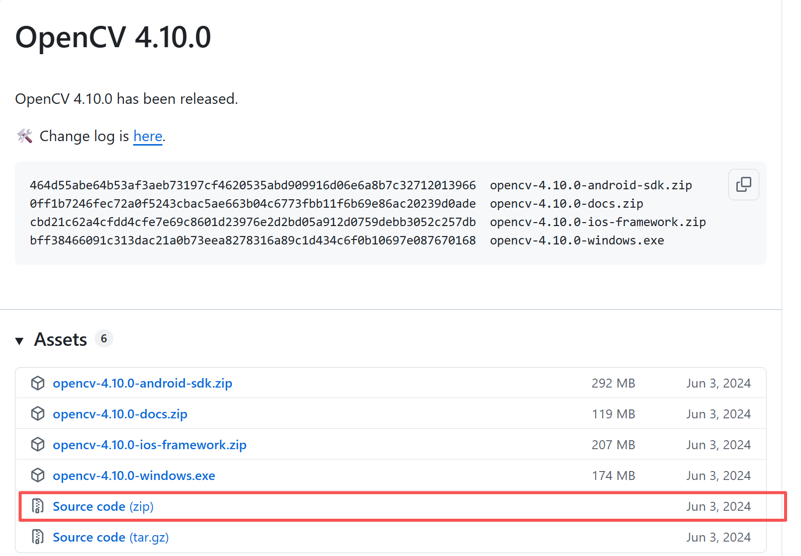
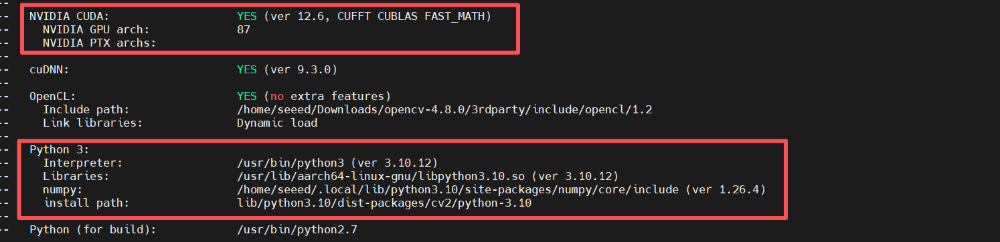
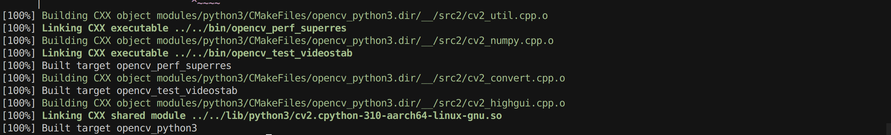
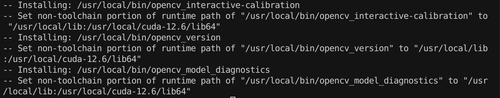
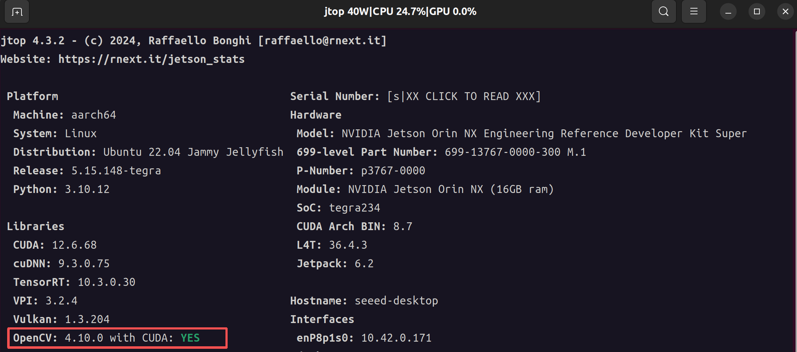
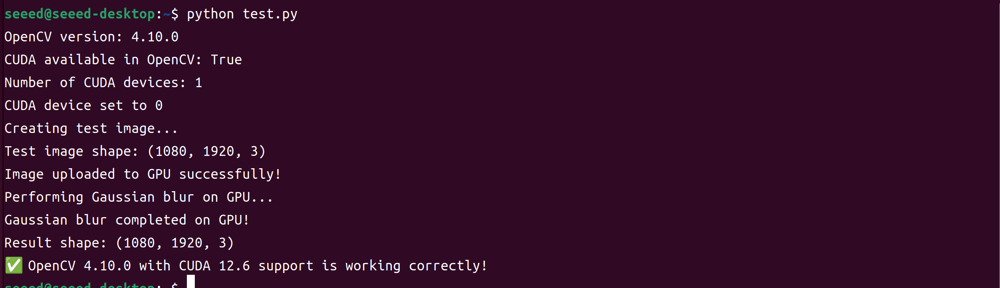

# Opencv with CUDA

## Introduction

​	**OpenCV (Open Source Computer Vision Library)** is an open-source software library designed for computer vision and image processing. It provides hundreds of optimized algorithms for tasks such as image and video analysis, object detection, facial recognition, feature extraction, camera calibration, and 3D reconstruction. 

​	JetPack comes with OpenCV pre-installed on reComputer devices, but the default version does **not include CUDA acceleration**. This means that while you can use OpenCV for standard image processing, GPU-accelerated functions (like `cv::cuda::GpuMat` operations, DNN inference, or real-time video processing) will not benefit from the Jetson's GPU.

By compiling OpenCV from source with **CUDA support**, you can leverage the GPU for many computer vision tasks, which significantly improves performance for:

- **Real-time video processing** (e.g., high-resolution camera streams)
- **Deep learning inference** using OpenCV DNN module
- **Image transformations and filters** that can be parallelized on the GPU
- **Computer vision pipelines in robotics or autonomous systems**, where low latency and high throughput are critical

So, compiling OpenCV with CUDA on Jetson allows you to fully utilize the GPU for accelerated computer vision workloads, making applications faster and more efficient.

This tutorial will guide you step by step on how to install the version of OpenCV that supports CUDA.



> Note:The demonstration environment is Jetpack 6.2

## Compiling OpenCV with CUDA

**Step 1.** Uninstall the Python packages and library files

```bash
pip list | grep opencv
pip3 uninstall opencv-python
sudo apt purge libopencv*
sudo apt autoremove
sudo apt update
```

**Step 2.** Install the required dependent libraries for the subsequent compilation process.

> **Note**:The following dependencies are for the Jetpack 6.2 Ubuntu 22.04 system. The names of dependencies in other environments may be different!

```bash
sudo apt install -y build-essential checkinstall cmake pkg-config yasm git gfortran
sudo apt update
sudo apt install -y libgstreamer1.0-dev libgstreamer-plugins-base1.0-dev
sudo apt install -y libjpeg8-dev libpng-dev libtiff5-dev libavcodec-dev libavformat-dev libswscale-dev libxine2-dev libv4l-dev libdc1394-dev libopenjp2-7-dev
sudo apt install -y libgstreamer1.0-dev libgstreamer-plugins-base1.0-dev libgtk2.0-dev libtbb-dev libatlas-base-dev libfaac-dev libmp3lame-dev libtheora-dev libvorbis-dev libxvidcore-dev libopencore-amrnb-dev libopencore-amrwb-dev x264 v4l-utils
sudo apt install -y \
  python3-dev python3-numpy \
  libtbb2 libtbb-dev libjpeg-dev libpng-dev libtiff-dev \
  libavcodec-dev libavformat-dev libswscale-dev libv4l-dev \
  libxvidcore-dev libx264-dev libgtk-3-dev libcanberra-gtk3-dev \
  libatlas-base-dev gfortran
```

**Step 3.** Download the official source code.

Here, we are using version 4.10.0 of [OpenCV](https://github.com/opencv/opencv/releases) and [OpenCV_contrib](https://github.com/opencv/opencv_contrib/releases/tag/4.10.0).



```bash
wget https://github.com/opencv/opencv/archive/refs/tags/4.10.0.zip
unzip 4.10.0.zip
rm 4.10.0.zip
wget https://github.com/opencv/opencv_contrib/archive/refs/tags/4.10.0.zip
unzip 4.10.0.zip -d opencv-4.10.0/
cd opencv-4.10.0
```

**Step 4.** Build and install Opencv.

```bash
mkdir build 
cd build
export PATH=/usr/local/cuda-12.6/bin:$PATH && export LD_LIBRARY_PATH=/usr/local/cuda-12.6/lib64:$LD_LIBRARY_PATH 

cmake \
-DCMAKE_BUILD_TYPE=Release \
-DCMAKE_INSTALL_PREFIX=/usr/local \
-DOPENCV_ENABLE_NONFREE=ON \
-DWITH_FFMPEG=ON \
-DWITH_CUDA=ON \
-DCUDA_TOOLKIT_ROOT_DIR=/usr/local/cuda-12.6 \
-DCUDA_ARCH_BIN=8.7 \
-DCUDA_ARCH_PTX="" \
-DENABLE_FAST_MATH=ON \
-DCUDA_FAST_MATH=ON \
-DWITH_CUBLAS=ON \
-DOPENCV_GENERATE_PKGCONFIG=ON \
-DBUILD_opencv_python2=OFF \
-DBUILD_opencv_python3=ON \
-DPYTHON3_EXECUTABLE=$(which python3) \
-DPYTHON3_INCLUDE_DIR=$(python3 -c "from sysconfig import get_paths as gp; print(gp()['include'])") \
-DPYTHON3_LIBRARY=$(python3 -c "import sysconfig; print(sysconfig.get_config_var('LIBDIR') + '/libpython' + sysconfig.get_python_version() + '.so')") \
-DOPENCV_EXTRA_MODULES_PATH=/home/seeed/Downloads/opencv_contrib/modules \
..

```

>  **-DWITH_FFMPEG=ON**   Enabling FFMPEG support enables OpenCV to read and write various video formats (avi, mp4, mkv). If it is turned off, only MJPEG/RAW video streams can be accessed.
>
> **-DWITH_CUDA=ON**  Enable CUDA acceleration
>
> **-DCUDA_TOOLKIT_ROOT_DIR=/usr/local/cuda**  Specify the CUDA installation path
>
> **-DCUDA_ARCH_BIN=8.7**  Specify the computing power of the designated target GPU. Different modules are listed in the table below.
>
> | Jetson Model          | GPU Architecture | SM Count | Compute Capability (CUDA_ARCH_BIN) |
> | --------------------- | ---------------- | -------- | ---------------------------------- |
> | **Jetson Nano**       | Maxwell          | 128      | **5.3**                            |
> | **Jetson TX1**        | Maxwell          | 256      | **5.3**                            |
> | **Jetson TX2**        | Pascal           | 256      | **6.2**                            |
> | **Jetson Xavier NX**  | Volta            | 384      | **7.2**                            |
> | **Jetson AGX Xavier** | Volta            | 512      | **7.2**                            |
> | **Jetson Orin Nano**  | Ampere           | 512      | **8.7**                            |
> | **Jetson Orin NX**    | Ampere           | 1024     | **8.7**                            |
> | **Jetson AGX Orin**   | Ampere           | 2048     | **8.7**                            |
>
> **-DPYTHON3_EXECUTABLE=$(which python3)** 
> **-DPYTHON3_INCLUDE_DIR**
> **-DPYTHON3_LIBRARY**       
>
> Specify the path of Python3, header files, and dynamic libraries. If a virtual environment is installed, you need to modify it to the path of the compiler of your own virtual environment.

During the CMake process, some configuration information is displayed.



**Step 5.** Build the project and install.

```bash
#The compilation process may take a while! Please wait patiently!
make -j4
```



```bash
sudo make install
```



**Step 6.** Verify installation.

After the installation is completed, open jtop. You will see that "opencv with cuda" has changed to "yes".

```bash
jtop
```



Test whether Python can successfully import OpenCV.Use the following Python test script:

```python
#python
import cv2
import numpy as np

print("OpenCV version:", cv2.__version__)

# Check if OpenCV has the CUDA module installed
print("CUDA available in OpenCV:", cv2.cuda.getCudaEnabledDeviceCount() > 0)

if cv2.cuda.getCudaEnabledDeviceCount() > 0:
    print("Number of CUDA devices:", cv2.cuda.getCudaEnabledDeviceCount())
    cv2.cuda.setDevice(0)
    print("CUDA device set to 0")

    # Test the GPU acceleration function
    print("Creating test image...")
    img = (np.random.rand(1080, 1920, 3) * 255).astype("uint8")
    print("Test image shape:", img.shape)

    # Upload to GPU
    gpu_img = cv2.cuda_GpuMat()
    gpu_img.upload(img)
    print("Image uploaded to GPU successfully!")

    # Perform Gaussian blurring on the GPU
    print("Performing Gaussian blur on GPU...")
    gaussian = cv2.cuda.createGaussianFilter(gpu_img.type(), gpu_img.type(), (15, 15), 0)
    gpu_result = gaussian.apply(gpu_img)

    # Download result
    result = gpu_result.download()
    print("Gaussian blur completed on GPU!")
    print("Result shape:", result.shape)
    print("✅ OpenCV 4.10.0 with CUDA 12.6 support is working correctly!")

else:
    print("❌ No CUDA device found or OpenCV not built with CUDA.")
```




## Resource

https://github.com/opencv

https://docs.opencv.org/4.10.0/d2/dbc/cuda_intro.html

