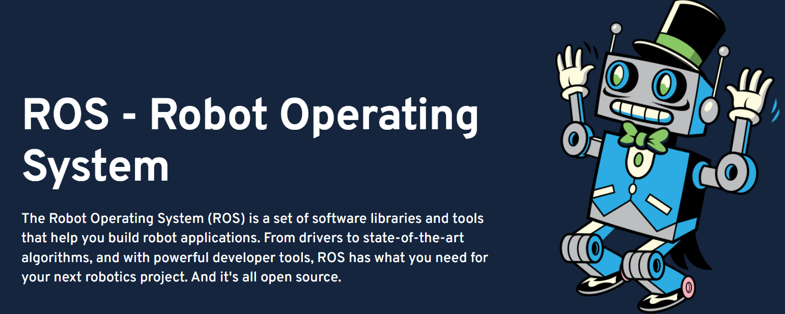
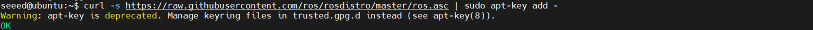
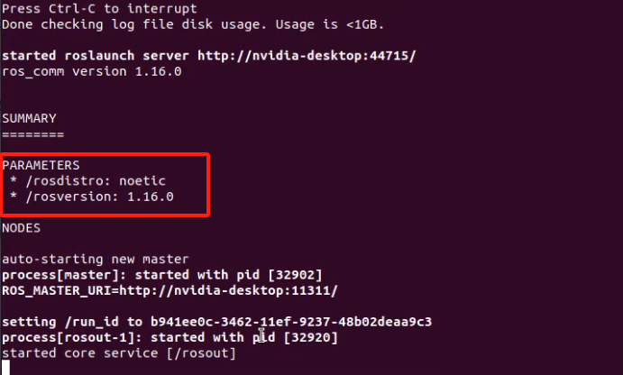
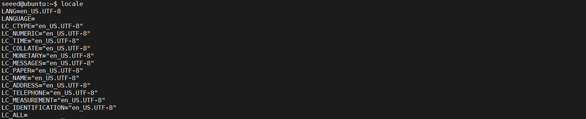
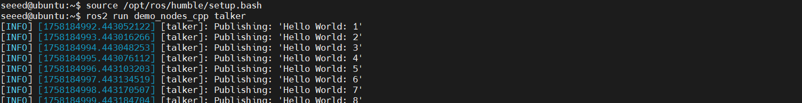
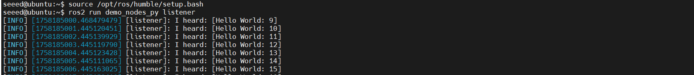

# Install ROS in reComputer

## Introduction

[**ROS (Robot Operating System)**](https://www.ros.org/) is an open-source framework for building robot software. It is not actually an operating system, but rather a flexible middleware that provides tools, libraries, and conventions to simplify the development of complex and distributed robotic systems.

Key features of ROS include:

- **Modular Design** – It organizes software into packages and nodes, making code reusable and easy to maintain.
- **Communication Infrastructure** – ROS uses a publisher/subscriber model for message passing and a service/action system for request/response interactions between nodes.
- **Simulation and Visualization** – Tools like RViz and Gazebo allow developers to visualize sensor data and simulate robots in a virtual environment.
- **Hardware Abstraction** – ROS provides drivers for many sensors and actuators, making it easier to integrate real-world hardwar

This tutorial will show you how to install the development environment for ROS1 and ROS2 on [reComputer](https://www.seeedstudio.com/reComputer-Robotics-J4012-with-GMSL-extension-board-p-6537.html).

> **Note:**Please select different ROS versions based on the version of Ubuntu in your system.

| **JetPack Version** | **Ubuntu Version** | **Recommended ROS Version** | **Use Case** |
| ------------------- | ------------------ | --------------------------- | ------------ |

| **JetPack 5.x** | Ubuntu 20.04 | ROS1 Noetic ✅   ROS2 Foxy ✅ | Best choice for projects needing ROS1/ROS2 hybrid development, long-term support, and stable ecosystem. |
| --------------- | ------------ | :-------------------------: | ------------------------------------------------------------ |

| **JetPack 6.x** | Ubuntu 22.04 | ROS2 Humble   ✅ | Ideal for new projects, long-term maintenance, and leveraging Jetson Orin / newer hardware features. ROS1 not officially available (use Docker or build from source if needed). |
| :-------------- | ------------ | --------------- | ------------------------------------------------------------ |


## Install ROS1

​	**ROS1 (Robot Operating System 1)** is an open-source framework for building robot software. It uses a central master (`roscore`) and a node-based architecture, where nodes communicate via topics, services, and actions. ROS1 provides tools for visualization, simulation, and data logging, and is widely used in robotics research and prototyping.

**Step 1. **Setup your computer to accept software from packages.ros.org.

```bash
sudo sh -c '. /etc/lsb-release && echo "deb http://mirrors.ustc.edu.cn/ros/ubuntu/ `lsb_release -cs` main" > /etc/apt/sources.list.d/ros-latest.list'
```

Note:Please setting up your sources.list file based on the region where you are located.Follow by this [artical](https://wiki.ros.org/ROS/Installation/UbuntuMirrors#China)

**Step 2.** Set up your keys.

```bash
sudo apt install curl gnupg2 lsb-release -y # if you haven't already installed curl

curl -s https://raw.githubusercontent.com/ros/rosdistro/master/ros.asc | sudo apt-key add -
```



**Step 3.** Installation.

```bash
sudo apt update
sudo apt install ros-noetic-desktop-full
sudo apt-get install python3-rosdep
sudo rosdep init
rosdep update
```

**Step 4.** Set Up ROS Environment.

```bash
echo "source /opt/ros/noetic/setup.bash">> ~/.bashrc &&
source ~/.bashrc
```

**Step 5.** Install Dependency Tools.

```bash
sudo apt install python3-rosinstall python3-rosinstall-generator python3-wstool build-essential
```

**Step 6.** Test the Installation.

```bash
roscore
```



More details you can refer to [here](https://wiki.ros.org/noetic/Installation/Ubuntu)

## Install ROS2

​	**ROS2 (Robot Operating System 2)** is the second generation of the open-source robotics framework, designed to overcome the limitations of ROS1. It is built on top of DDS (Data Distribution Service) for reliable, real-time, and secure communication. ROS2 supports multi-robot systems, works on multiple platforms (Linux, Windows, macOS), and offers improved performance, security, and scalability compared to ROS1.

**Step 1.** Set locale.

```bash
locale  # check for UTF-8
```



```bash
sudo apt update && sudo apt install locales
sudo locale-gen en_US en_US.UTF-8
sudo update-locale LC_ALL=en_US.UTF-8 LANG=en_US.UTF-8
export LANG=en_US.UTF-8
locale  # verify settings
```

**Step 2.** You will need to add the ROS 2 apt repository to your system.

```bash
sudo apt install software-properties-common
sudo add-apt-repository universe
```

**Step 3.**   Add the official ROS2 apt repository to your Ubuntu system.

```bash
sudo apt update && sudo apt install curl -y
export ROS_APT_SOURCE_VERSION=$(curl -s https://api.github.com/repos/ros-infrastructure/ros-apt-source/releases/latest | grep -F "tag_name" | awk -F\" '{print $4}')
curl -L -o /tmp/ros2-apt-source.deb "https://github.com/ros-infrastructure/ros-apt-source/releases/download/${ROS_APT_SOURCE_VERSION}/ros2-apt-source_${ROS_APT_SOURCE_VERSION}.$(. /etc/os-release && echo $VERSION_CODENAME)_all.deb" # If using Ubuntu derivates use $UBUNTU_CODENAME
sudo dpkg -i /tmp/ros2-apt-source.deb
```

**Step 4.**  Install ROS 2 packages.

```bash
sudo apt update
sudo apt install ros-humble-desktop

```

**Step 5.** Install Additional Build Tools.

```bash
sudo apt install ros-dev-tools
```

**Step 6.** Initialize ROS Environment.

```bash
sudo rosdep init
rosdep update
```

**Step 7.** Set Up ROS Environment Variables.

```bash
echo "source /opt/ros/humble/setup.bash" >> ~/.bashrc
source ~/.bashrc
```

**Step 8.** Try some examples to verify the installation.

​	In one terminal, source the setup file and then run a C++ `talker`:

```bash
source /opt/ros/humble/setup.bash
ros2 run demo_nodes_cpp talker
```

​	In another terminal source the setup file and then run a Python `listener`:

```bash
source /opt/ros/humble/setup.bash
ros2 run demo_nodes_py listener
```





​	Now, congratulations! 🎉You have successfully installed ROS2. You can now embark on a pleasant development journey.

More details you can refer to [here](https://docs.ros.org/en/humble/Installation/Ubuntu-Install-Debs.html)


## Resource

[ROS1 Tutorials](https://wiki.ros.org/ROS/Tutorials)

[ROS2 Tutorials](https://docs.ros.org/en/humble/Tutorials.html)

**Related demo:**

[A-LOAM 3D SLAM](https://wiki.seeedstudio.com/a_loam/)

[Isaac ROS Visual SLAM](https://wiki.seeedstudio.com/isaac_ros_visual_slam/)

[Control PX4 with reComputer](https://wiki.seeedstudio.com/control_px4_with_recomputer_jetson/)